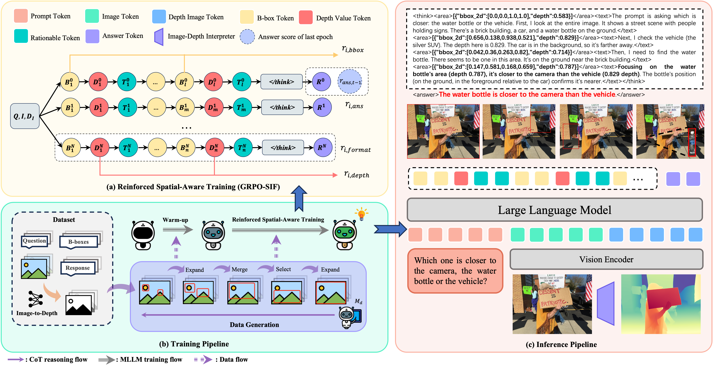

# SIFThinker: Spatially-Aware Image Focus for Visual Reasoning
[](https://arxiv.org/abs/2508.06259)
[](https://huggingface.co/datasets/jankin123/SIF-50K)

## Instruction
Current multimodal large language models (MLLMs) still face significant challenges in complex visual tasks (e.g., spatial understanding, fine-grained perception). Prior methods have tried to incorporate visual reasoning, however, they fail to leverage attention correction with spatial cues to iteratively refine their focus on prompt-relevant regions. In this paper, we introduce SIFThinker, a spatially-aware “think-with-images” framework that mimics human visual perception. Specifically, SIFThinker enables attention correcting and image region focusing by interleaving depth-enhanced bounding boxes and natural language. Our contributions are twofold: First, we introduce a reverse-expansion-forward-inference strategy that facilitates the generation of interleaved image-text chains of thought for process-level supervision, which in turn leads to the construction of the SIF-50K dataset. Besides, we propose GRPO-SIF, a reinforced training paradigm that integrates depth-informed visual grounding into a unified reasoning pipeline, teaching the model to dynamically correct and focus on prompt-relevant regions. Extensive experiments demonstrate that SIFThinker outperforms state-of-the-art methods in spatial understanding and fine-grained visual perception, while maintaining strong general capabilities, highlighting the effectiveness of our method.

## Method overview


## Env Setup
```bash
git clone https://github.com/zhangquanchen/SIFThinker.git
cd SIFThinker/GRPO-SIF
conda create -n SIFThinker python=3.10 -y && conda activate SIFThinker
bash setup.sh
```
If the installed trl version conflicts with our repository, replace it with the local copy by running:
```bash
cp -rf ../package/trl /home/tiger/anaconda3/envs/SIFThinker/lib/python3.10/site-packages/
```
Some may need to install:
```bash
pip install httpx==0.23.0
apt install libgl1-mesa-glx
```

## Data
Dataset is available in [Here](https://huggingface.co/datasets/jankin123/SIF-50K) !!!
### SIF-50K
Our constructed dataset SIF-50K will be uploaded. Include `SIF-50K-sampled-200.json` for SFT, `SIF-50K-sampled-200.json` for RL. Along with some RGB images and depth images from different sources. After downding, please place them under `data/` folder.
### Data Generation
We also provide scripts for reproduing SIF-50K dataset. If you don't want to produce the dataset again, you can skip this section.
You can run the data generation as the following steps:
* step1: Download the [VisCoT](https://huggingface.co/datasets/deepcs233/Visual-CoT). Change the image folder and JSON url in Line 313 and 484 in `data_generation/produce.py` to where you download the VisCoT.
* step2: Follow the instructions of [DepthAnything](https://github.com/DepthAnything/Depth-Anything-V2) to setup environment.
* step3: Add api key and llm config to Line 403, 489 and 490 in `data_generation/produce.py`
* step4: Run the data generation script.
```bash
cd data_generation
python produce.py
```
Remark: Same operation can be used to the [TallyQA](ttps://github.com/manoja328/TallyQA_dataset), refer to `data_generation/misc/produce_tallyqa.py`

## Training
### Warm up
You can follow [LLaMA-Factory](https://github.com/hiyouga/LLaMA-Factory) for environment setup and SFT training. Our hyperparameter and setting has been included in `SFT` folder. Specifically:
1. You can use the setting under `SFT/env` to setup the environment.
2. Run warm up training as:
```bash
cd SFT
llamafactory-cli train train_sft.yaml
```

### GRPO-SIF
In GRPO-SIF, the key modification lies in the reward function used during training. 
Taking Qwen2.5-VL as an example, the reward function is defined in: `GRPO-SIF/src/open-r1-multimodal/src/open_r1/vlm_modules/qwen_module.py`.
Progressive learning defination is from `SIFThinker/GRPO-SIF/src/open-r1-multimodal/src/open_r1/trainer/grpo_trainer.py`.

You can run the GRPO-SIF training as the following steps:
* step1: Add api key and llm config to Line 167, 168 and 261 in `GRPO-SIF/src/open-r1-multimodal/src/open_r1/vlm_modules/qwen_module.py`
* step2: We use `SIF-50K-sampled-200.json` for trainning. Please place the dataset ahead under `data/` folder. 
* step3: Run the training script.
```bash
bash run_scripts/train_grpo_sif.sh
```

### Merge the weight
Remember to merge the weight after each trainning phases under `scripts`.
```bash
llamafactory-cli export merge.yaml
```

## Inference
You can selectively choose VLLM/Huggingface for inferencing.
```bash
API_PORT=8020 llamafactory-cli api inference.yaml
```
Then, you can use the scripts `scripts/infer.py` to infer.

## Evaluation
We following [VisCoT](https://github.com/deepcs233/Visual-CoT/tree/main), [SpatialBot](https://github.com/BAAI-DCAI/SpatialBot), [SAT](https://github.com/arijitray1993/SAT), [V*](https://github.com/penghao-wu/vstar?tab=readme-ov-file#evaluation), [CV-Bench](https://github.com/cambrian-mllm/cambrian#evaluation),ect. to eval the results. Some modifications of the scripts are in `scripts/evaluation/` folder. (We use vllm-8020 to infer.)

## Acknowledgement
The repo also benifits form [VLM-R1](https://github.com/om-ai-lab/VLM-R1), [Visual-CoT](https://github.com/deepcs233/Visual-CoT), [LLaVA](https://github.com/haotian-liu/LLaVA), [SpatialBot](https://github.com/BAAI-DCAI/SpatialBot), [SAT](https://github.com/arijitray1993/SAT), [V*](https://github.com/penghao-wu/vstar?tab=readme-ov-file#evaluation), [OVD-Eval](https://github.com/om-ai-lab/OVDEval), [trl](https://github.com/huggingface/trl), , [Cambrian](https://github.com/cambrian-mllm/cambrian).

Thanks for their wonderful works.

## Bibtex
If you find SIFThinker helpful for your work, please cite

```
@article{chen2025sifthinker,
  title={SIFThinker: Spatially-Aware Image Focus for Visual Reasoning},
  author={Chen, Zhangquan and Zhao, Ruihui and Luo, Chuwei and Sun, Mingze and Yu, Xinlei and Kang, Yangyang and Huang, Ruqi},
  journal={arXiv preprint arXiv:2508.06259},
  year={2025}
}
```
